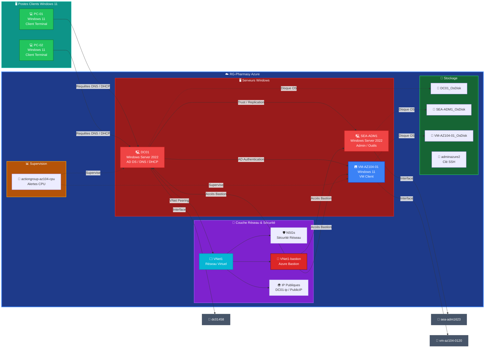

# Diagramme d'Architecture - RG-Pharmasy

Ce diagramme illustre l'infrastructure RG-Pharmasy avec les serveurs Windows, VMs clientes et les composants réseau Azure.

## Diagramme Mermaid

## Légende des Couleurs

| Couleur | Composant | Description |
|---------|-----------|-------------|
| 🟢 Rouge | Serveurs Windows | DC01, SEA-ADM1 (AD DS, Admin) |
| 🔵 Bleu | VMs Clients | VM-AZ104-01 (Windows 11) |
| 🟢 Vert | Postes Clients | PC-01, PC-02 (Windows 11) |
| 🟣 Violet | Réseau & Sécurité | VNet, NSGs, Bastion, IP Publiques |
| 🟢 Vert foncé | Stockage | Disques OS, Clé SSH |
| 🟠 Orange | Supervision | Groupe d'alertes CPU |
