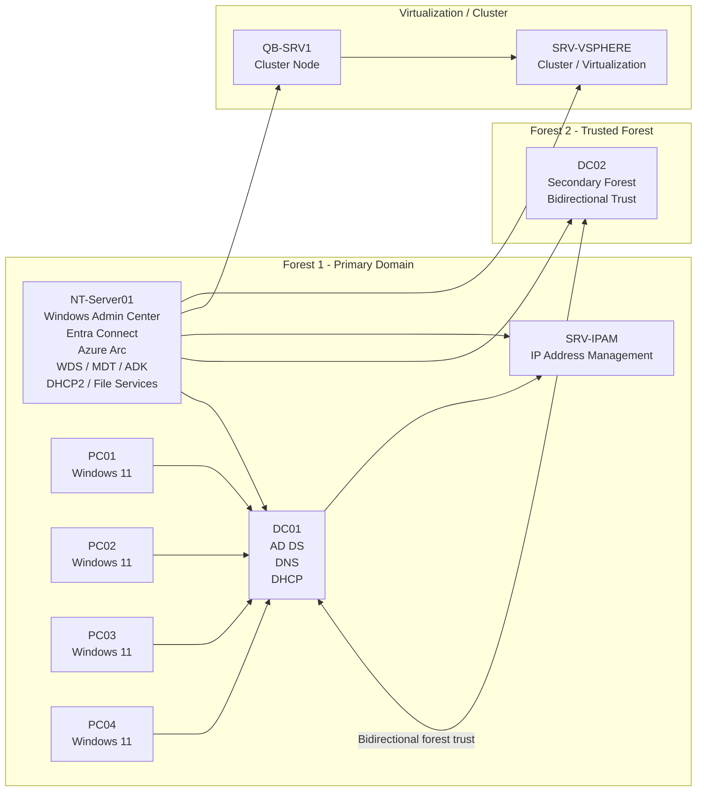

## Network Diagram

```mermaid
flowchart LR
    subgraph FOREST1["Forest 1 - Primary Domain"]
        DC01["DC01
AD DS
DNS
DHCP"]
        IPAM["SRV-IPAM
IP Address Management"]
        NT["NT-Server01
Windows Admin Center
Entra Connect
Azure Arc
WDS / MDT / ADK
DHCP2 / File Services"]
        PC1["PC01
Windows 11"]
        PC2["PC02
Windows 11"]
        PC3["PC03
Windows 11"]
        PC4["PC04
Windows 11"]
    end

    subgraph FOREST2["Forest 2 - Trusted Forest"]
        DC02["DC02
Secondary Forest
Bidirectional Trust"]
    end

    subgraph VIRT["Virtualization / Cluster"]
        QB["QB-SRV1
Cluster Node"]
        VSP["SRV-VSPHERE
Cluster / Virtualization"]
    end

    DC01 <-->|Bidirectional forest trust| DC02
    DC01 --> IPAM
    NT --> DC01
    NT --> DC02
    NT --> IPAM

    PC1 --> DC01
    PC2 --> DC01
    PC3 --> DC01
    PC4 --> DC01

    QB --> VSP
    NT --> QB
    NT --> VSP
```
